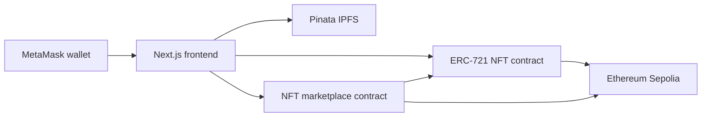

# ERC-721 NFT Marketplace

A full-stack decentralized NFT marketplace built for the DaFi Labs Blockchain
and Web3 internship assignment. Users can upload NFT assets and metadata to
Pinata IPFS, mint ERC-721 tokens, list them for sale, purchase them with another
wallet, cancel listings, resell purchased NFTs, and withdraw sale proceeds.

The contracts are deployed and verified on Ethereum Sepolia. The frontend reads
ownership and marketplace activity from the deployed contracts rather than from
hardcoded records.

## Live project

- Live application: Add the Vercel URL after deployment.
- GitHub repository: <https://github.com/NumanMaroof085-1/nftMarketplace>
- Network: Ethereum Sepolia (`chainId: 11155111`)

## Verified Sepolia contracts

| Contract | Address | Verification |
| --- | --- | --- |
| NFT | `0xeF6921a2743Be0953E1855B1F81D330cE97E1Db5` | [Etherscan](https://sepolia.etherscan.io/address/0xeF6921a2743Be0953E1855B1F81D330cE97E1Db5#code) |
| NFTMarketplace | `0x27b33F1A4f79346305Fe20779F339D79996569ec` | [Etherscan](https://sepolia.etherscan.io/address/0x27b33F1A4f79346305Fe20779F339D79996569ec#code) |

Machine-readable deployment details are stored in
[`deployments/sepolia.json`](deployments/sepolia.json). Hardhat Ignition's
deployment journal is included under `ignition/deployments/chain-11155111/`.

## Features

- MetaMask connection, account updates, and Sepolia network handling.
- NFT image and metadata uploads through Pinata IPFS.
- ERC-721 minting with permanent `ipfs://CID` token URIs.
- Live discovery gallery built from Sepolia mint events and IPFS metadata.
- NFT details with current owner, creator, token ID, contract, price, and status.
- Marketplace approval and price validation before listing.
- Exact-price NFT purchases and automatic ownership transfer.
- Seller-only listing cancellation and buyer relisting.
- Pull-payment proceeds dashboard with secure withdrawals.
- Account tabs for My NFTs, My Listings, Purchased NFTs, and Sold NFTs.
- Active, sold, cancelled, pending, confirmed, rejected, and failed states.
- Graceful placeholders when individual IPFS files are unavailable.
- Responsive layouts for desktop, tablet, and mobile screens.

## Architecture



The NFT contract controls token ownership and token URIs. The marketplace
contract records listings, validates ownership and approval, transfers NFTs,
and records seller proceeds. The Next.js server keeps the Pinata JWT private
while the browser uses Wagmi and Viem for wallet transactions.

## Marketplace security and fees

- The marketplace fee is `250` basis points, or 2.5% of each completed sale.
- Seller proceeds are 97.5% of the price; the remaining 2.5% is assigned to the
  configured fee recipient.
- ETH is stored in `pendingProceeds` until each recipient calls
  `withdrawProceeds`. This pull-payment design avoids sending ETH during the NFT
  transfer.
- Purchase and withdrawal functions use OpenZeppelin `ReentrancyGuard`.
- Ownership, approval, price, listing status, exact payment, and authorization
  are validated with custom Solidity errors.
- Contract state is updated before external transfers.

## Technology

- Solidity 0.8.28 and OpenZeppelin Contracts 5
- Hardhat 3, Hardhat Ignition, Solidity tests, and Node.js lifecycle tests
- Next.js 16, React 19, TypeScript, Wagmi, Viem, and TanStack Query
- Pinata IPFS for NFT assets and JSON metadata
- Ethereum Sepolia and MetaMask
- Vercel for the production frontend

## Project structure

```text
contracts/                 NFT and marketplace contracts plus Solidity tests
ignition/modules/          Repeatable Hardhat Ignition deployment module
ignition/deployments/      Saved Sepolia deployment history
scripts/                   Sepolia connection checks
test/                      End-to-end marketplace lifecycle test
deployments/               Public deployed-address record
frontend/                  Next.js marketplace application
docs/screenshots/          Submission screenshot checklist
```

## Prerequisites

- Node.js 22 or newer
- MetaMask
- Sepolia ETH for deployment and test transactions
- A Sepolia RPC endpoint
- An Etherscan API key
- A Pinata account, JWT, and dedicated gateway domain

Never use a wallet containing real funds for testnet development.

## Contract setup and testing

Install the root dependencies:

```bash
npm install
```

Use `.env.example` as the list of required deployment values. Set them as
environment variables or store them in Hardhat's encrypted keystore:

```bash
npx hardhat keystore set SEPOLIA_RPC_URL
npx hardhat keystore set SEPOLIA_PRIVATE_KEY
npx hardhat keystore set ETHERSCAN_API_KEY
```

Build and test the contracts:

```bash
npm run build
npm test
npm run typecheck
```

The suite contains 40 Solidity tests plus one Node.js end-to-end test. It covers
minting, approvals, listing, purchase, cancellation, fees, withdrawals,
relisting, access control, events, and failure cases.

Check the configured deployment wallet and Sepolia connection:

```bash
npm run check:sepolia
```

## Sepolia deployment

Deploy both contracts and submit their source code for verification:

```bash
npx hardhat ignition deploy ignition/modules/NFTMarketplace.ts --network sepolia --verify
```

Hardhat Ignition uses the deployment account as the marketplace fee recipient.
When deploying a new instance, update `deployments/sepolia.json` and
`frontend/src/config/contracts.ts` with the new addresses and deployment block.

## Frontend setup

Install the frontend dependencies:

```bash
cd frontend
npm install
```

Copy `frontend/.env.example` to `frontend/.env.local` and replace the
placeholders:

```env
PINATA_JWT=your_pinata_jwt
PINATA_GATEWAY=your-gateway.mypinata.cloud
```

`PINATA_JWT` is server-only. Do not prefix it with `NEXT_PUBLIC_` or commit the
`.env.local` file.

Start the application:

```bash
npm run dev
```

Open <http://localhost:3000>. Validate the production build with:

```bash
npm run lint
npm run build
```

## Marketplace demonstration flow

1. Connect the creator wallet on Sepolia.
2. Upload an image and enter the required metadata.
3. Confirm the mint transaction.
4. Open the minted NFT and enter a listing price.
5. Approve the marketplace if requested, then create the listing.
6. Switch MetaMask to another funded account and purchase the NFT.
7. Confirm that ownership changed to the buyer.
8. Relist or cancel the purchased NFT from the new owner account.
9. Return to the seller account and withdraw its pending proceeds.
10. Review owned, listed, purchased, and sold history on the Account page.

## Deploying the frontend to Vercel

1. Import this GitHub repository into Vercel.
2. Set the Vercel project **Root Directory** to `frontend`.
3. Keep the detected Next.js build settings.
4. Add `PINATA_JWT` and `PINATA_GATEWAY` as production environment variables.
5. Deploy and run the complete two-wallet marketplace flow on the public URL.
6. Replace the live-application placeholder near the top of this README.
7. Add the final screenshots described in `docs/screenshots/README.md`.

Do not place private keys, RPC secrets, or deployment-wallet credentials in
Vercel. The frontend only needs the two Pinata values.

## Known limitations

- This educational deployment runs on Sepolia and has no monetary value.
- NFT metadata uses immutable token URIs. If nobody pins the referenced IPFS
  content, the token remains on-chain but its metadata may become unavailable.
- Discovery scans events beginning at the saved deployment block, which is
  appropriate for this assignment deployment but should be replaced by an
  indexer for a large production marketplace.
- Wallet support currently targets injected EIP-1193 wallets such as MetaMask.

## Submission items still completed outside the codebase

- Public Vercel application URL
- Final project screenshots
- Screen-recorded demonstration video and link
- LinkedIn post and link, tagging DaFi Labs and EmpRadar.ai

## License

Created as an educational internship assignment. No production warranty is
provided.
